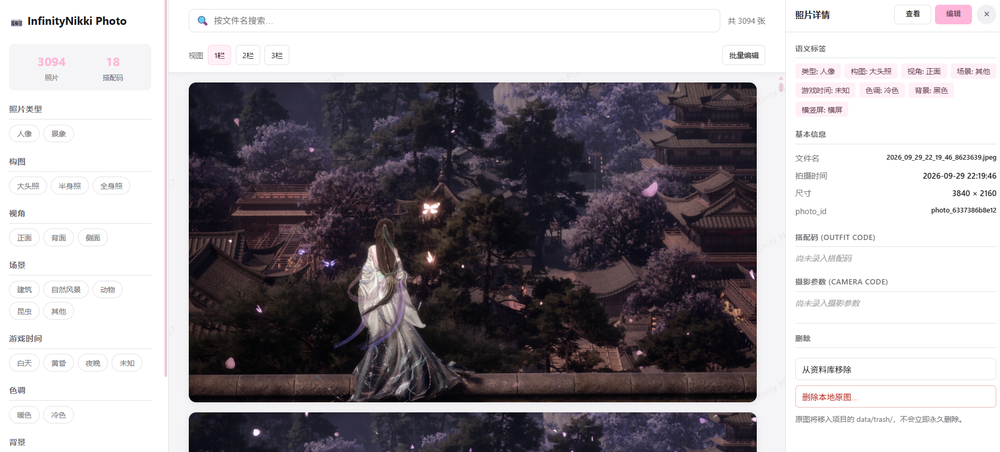

# InfinityNikki Photo Skill


A local multimodal photo management system for Infinity Nikki.

一个面向《无限暖暖》游戏摄影的本地多模态照片管理项目，支持游戏相册接管、视觉语义分析、照片检索、搭配码与摄影参数管理，并提供 Web UI 与 WorkBuddy Skill。

## 项目简介

《无限暖暖》游戏摄影过程中会积累大量本地照片。

当照片数量达到几百甚至几千张后，仅依赖文件夹和文件名已经很难快速找到过去拍摄的作品。

本项目直接接管《无限暖暖》本地游戏相册，通过 SQLite 建立照片数据库，并使用 Qwen2.5-VL 对照片进行语义分析，最终实现：

- 游戏照片统一管理
- AI 自动语义标注
- 多条件照片筛选
- 自然语言照片检索
- 搭配码管理
- 摄影参数管理
- Web 照片管理界面
- WorkBuddy Skill 调用

## Web UI

- 支持照片墙浏览、标签筛选、分页、1/2/3栏视图切换以及右侧照片详情管理。
- 支持查看并编辑照片语义标签、搭配码和摄影参数。
- 支持批量选择照片、批量校正语义标签，并可为多张照片设置相同搭配码。

## 项目流程

```text
Infinity Nikki 游戏相册
        ↓
照片扫描 / 增量同步
        ↓
SQLite 照片数据库
        ↓
Qwen2.5-VL
        ↓
照片语义标签
        ↓
照片检索与信息关联
        ↓
┌───────────────────────────────────┐
│                                   │
 Web Photo Manager   WorkBuddy Skill
│                                   │
└───────────────────────────────────┘